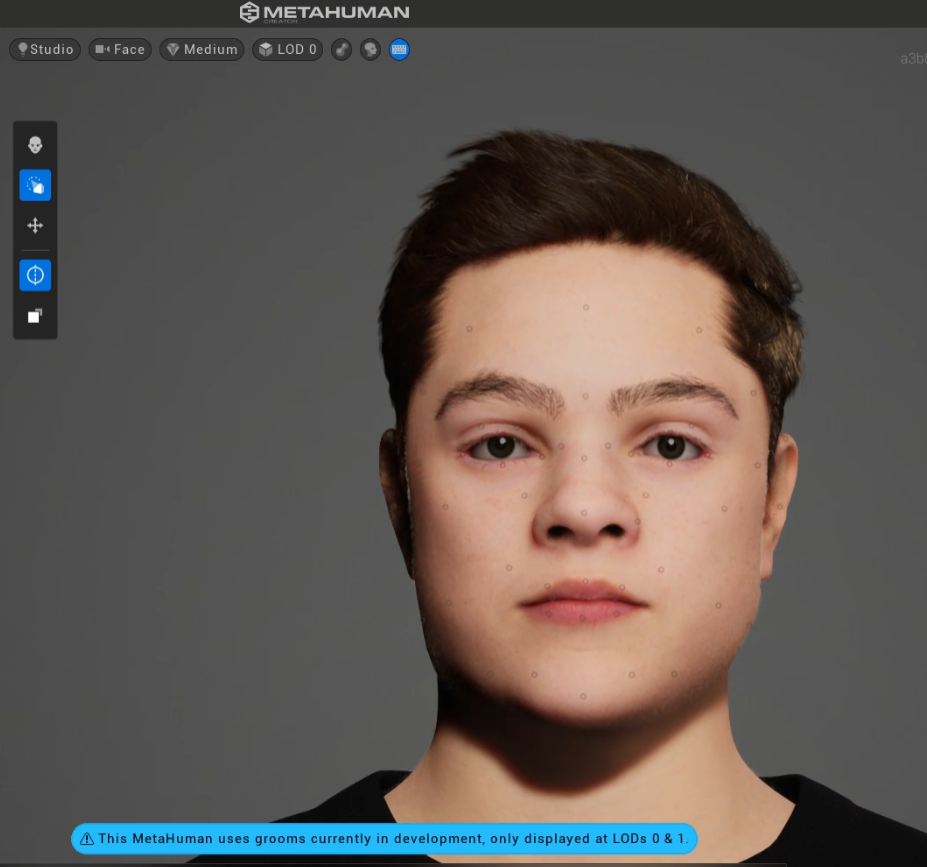

# FORR3FV05EU-lokaverkefni

## Hugmyndin
Hugmyndin mín fyrir lokaverkefnið var að gera 3D módel af Emil, vini mínum, og reyna að gera forrit eða vefsíðu sem getur sýnt hann að gera tutorial myndbönd fyrir fólk til að sjá, setja á pásu og fara í gegnum frame-by-frame.

## Framkvæmd
Fyrsti hlutinn af þessu verkefni var að gera 3D módel og reyna að rigga það, þannig að hægt væri að láta það spila animations.

Til þess notaði ég MetaHuman frá Unreal Engine, sem getur tekið inn mesh af andliti á einhverjum og á að geta breytt þeim í MetaHuman sjálfkrafa.

Þá byrjaði ég á því að reyna að gera mesh af andlitinu hans Emils, því eina meshið sem ég hafði núþegar var tveggja ára gamalt og bæði úrelt og ekki það gott til að byrja með.

Fyrst fékk ég myndband sem Emil tók sjálfur af andlitinu sínu, þar sem hann færir símann í kringum andlitið sitt til að forritið sem ég notaði (Meshroom) gæti skannað andlitið hans frá mörgum sjónarhornum.

---

Þetta leit alveg ágætlega vel út fannst mér, svo ég sendi þetta á Emil sjálfann.

---

En svo þegar þetta breyttist loksins í mesh sá ég að þetta var ekki mjög gott..

---

Eins og sést, er ekki hægt að sjá neitt andlit úr þessu þegar slökkt er á textures sem þýðir að ég hefði ekki getað notað þetta í MetaHuman creatornum.

---

Svo ég hitti Emil næstu helgina eftir þetta og tók upp 4k 60fps myndband af honum og gerði þetta aftur með **Agisoft Metashape** og það kom aðeins betur út.

---

Svo setti ég þetta inn í MetaHuman Creator og hann kom svona út:

Svo ég ákvað að reyna aftur og þá fékk ég þennann:

---

Mér fannst þessi líta meira út eins og emil og hugsaði að án þess að eyða rosalega miklum tíma, þá væri þetta örugglega eins nálægt alvöru Emil og ég kæmist á stuttum tíma.

---

Svo byrjaði ég á AR hlutnum, en fattaði strax að það myndi ekki enda alveg eins og ég hélt því það er ekki hægt að exporta MetaHuman utan Unreal Engine (og Autodesk Maya en þar eru strax tekin allskonar features eins og t.d. body rig svo ég gæti ekki animatað líkamann) svo ég þurfti þá að nota Unreal Engine 5 fyrir AR forritið mitt, sem ég kann ekkert á.

Ég byrjaði á því að nota AR template sem Unreal Engine býður upp á og tók strax eftir því að það notar eingöngu þeirra Node-Based forritun sem kallast Blueprints, en var ekki hægt að nota C++.

Svo tók ég eftir því að þetta forrit er gert fyrir Static Mesh, eitthvað sem MetaHumans eru ekki, svo ég þurfti að reyna að komast framhjá því. Eftir að ná á einhvern hátt að komast í gegnum það þá náði ég að builda forritið og setja Emil niður í veröldinni en sá strax tvö vandamál:

Hann var of stór og material-in fyrir peysu, buxur og skó virtust vera einhverskonar dynamic material sem virka ekki fyrir mobile, svo ég reyndi að breyta þessu yfir í static material, en það gerði ekkert á endanum, þó náði ég að laga stærðina.

Þetta var því miður eins langt og ég komst, en ég mun örugglega reyna að halda áfram eitthvað með MetaHuman af Emil í framtíðinni, mig langar sérstaklega að reyna að blanda saman MetaHuman, RVC (eða einhverju öðru AI voice cloning forriti) og ChatGPT (eða öðru conversational AI) og gera Emil Chatbot.

## [APK](/apk)
